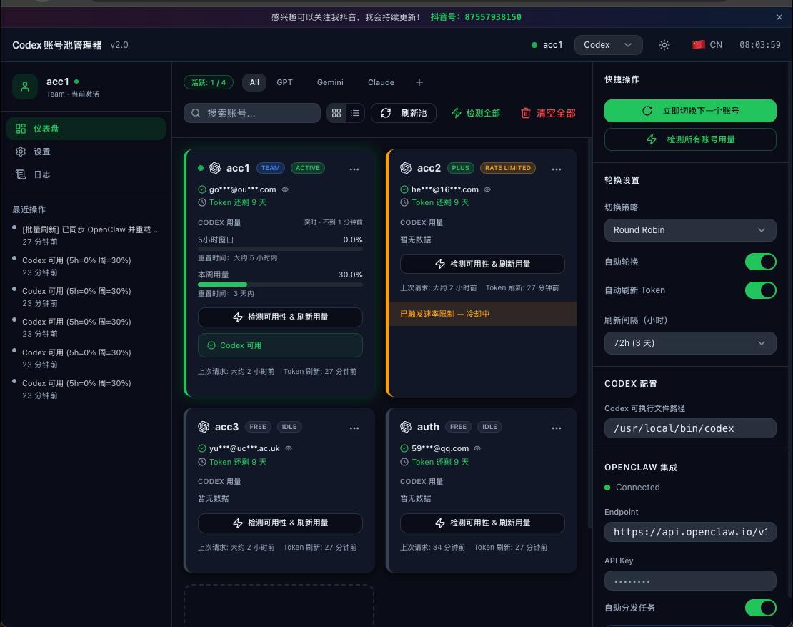
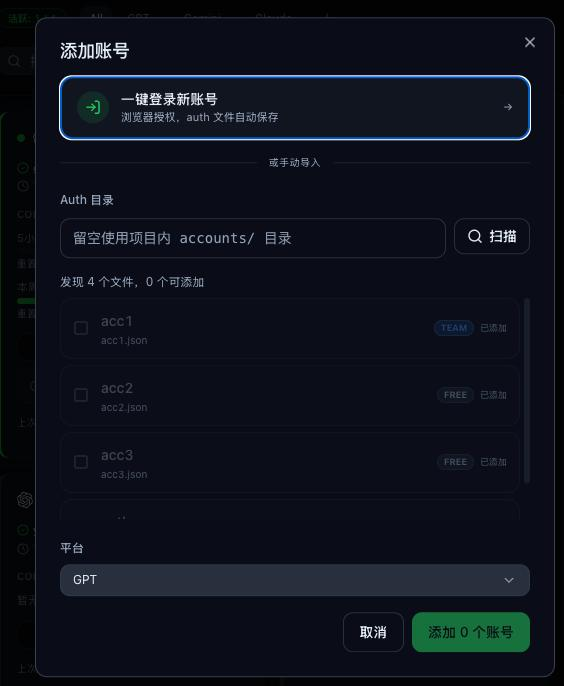
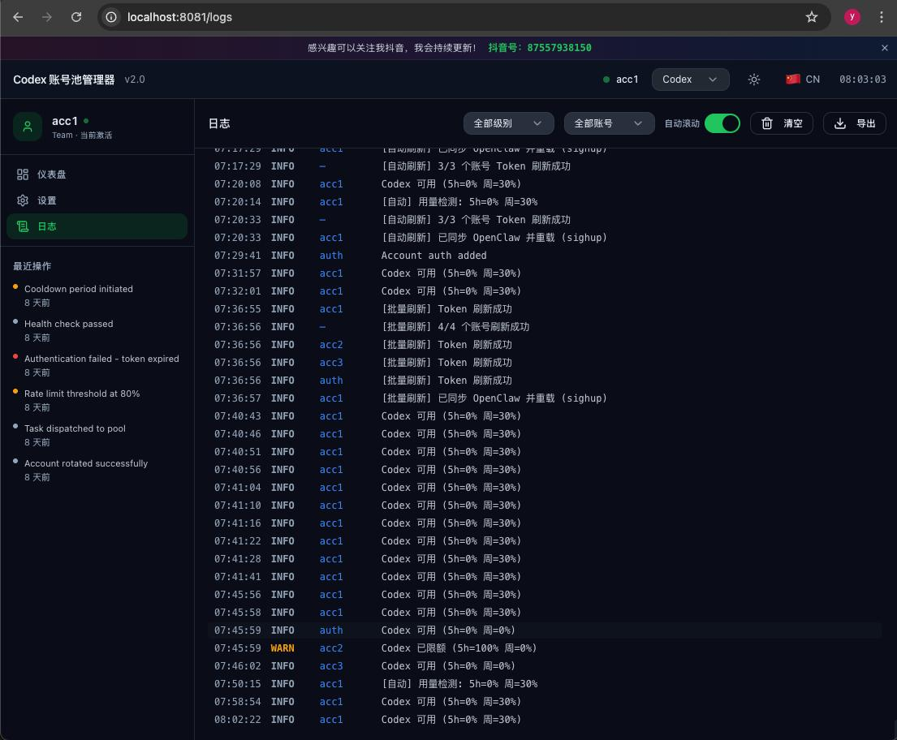

# 🦞 小龙虾 — Codex 账号池管理器

[](https://github.com/heyuqiu2023/CodexPool/releases)
[](LICENSE)
[](https://github.com/heyuqiu2023/CodexPool/stargazers)
[](https://nodejs.org)
[](https://www.douyin.com/search/87557938150)
[](https://www.xiaohongshu.com/search_result?keyword=9493195118)

多账号 Codex 管理仪表板，支持 GPT / Gemini / Claude 等多平台账号，实时监控用量、自动轮换，一键登录新账号。

> Originally designed for OpenAI Codex, but works with any platform using ChatGPT OAuth tokens.

---

## ✨ Features

- **平台分类** — 支持 GPT、Gemini、Claude 等多平台账号，可自定义添加新平台
- **一键登录** — 在界面内直接完成 `codex login` OAuth 授权，auth 文件自动保存
- **批量用量检测** — 一键检测所有账号的 5h 窗口用量，结果实时展示在各账号卡片
- **自动轮换** — 用量超过阈值时自动切换到下一个可用账号
- **亮暗主题** — 支持深色 / 浅色模式随时切换
- **紧凑列表视图** — 网格视图和紧凑列表视图自由切换
- **实时日志** — 完整记录轮换事件、Token 刷新、用量检测

## 📸 Screenshots

| 仪表板 | 添加账号 | 日志 |
|--------|---------|------|
|  |  |  |

---

## 🛠 Tech Stack

- **Frontend**: React + TypeScript + Vite + Tailwind CSS + shadcn/ui
- **Backend**: Express.js + Node.js
- **Database**: MySQL (via XAMPP)

---

## 🚀 Quick Start

### 1. Clone

```bash
git clone https://github.com/heyuqiu2023/CodexPool.git
cd CodexPool
```

### 2. Install

```bash
npm install
```

### 3. Configure

```bash
cp .env.example .env
```

Edit `.env`:

```env
PORT=3001
FRONTEND_ORIGIN=http://localhost:8080
DB_HOST=127.0.0.1
DB_PORT=3306
DB_SOCKET=/Applications/XAMPP/xamppfiles/var/mysql/mysql.sock
DB_USER=root
DB_PASSWORD=
DB_NAME=codex_pool_manager
VITE_API_BASE_URL=http://localhost:3001
```

### 4. Start MySQL

Start MySQL via XAMPP, create a database named `codex_pool_manager`. Tables are created automatically on first run.

### 5. Run

```bash
# Terminal 1 — backend
node server/index.js

# Terminal 2 — frontend
npm run dev
```

Open [http://localhost:8080](http://localhost:8080)

---

## ➕ Adding Accounts

### 方式一：一键登录（推荐）

1. 点击右上角 **+ 添加账号**
2. 点击 **一键登录新账号**
3. 在弹出的终端中完成浏览器 OAuth 授权
4. 授权成功后账号自动保存 ✅

### 方式二：手动导入

1. 在终端执行 `codex login`，完成授权
2. 复制 auth 文件：`cp ~/.codex/auth.json ~/Desktop/openai-accounts/acc1.json`
3. 点击 **+ 添加账号 → 扫描**，选择文件路径

---

## 🔄 Auto-Rotation

| 5h 用量 | 检查间隔 |
|--------|---------|
| < 50%  | 每 30 分钟 |
| 50–80% | 每 10 分钟 |
| > 80%  | 每 5 分钟 |
| **> 90%** | **立即切换** |

---

## ⚠️ Notes

- Auth 文件包含 OAuth Token，请勿提交到版本控制
- 用量检测调用零 Token 接口，不消耗 Codex 配额
- 自动轮换仅在开启 **自动轮换** 开关时生效

---

## ❤️ 赞助

如果这个项目对你有帮助，欢迎请我喝杯咖啡 ☕

你的支持是我持续更新、带来更好作品的动力，感谢每一位愿意赞助的朋友！


---

## License

MIT
