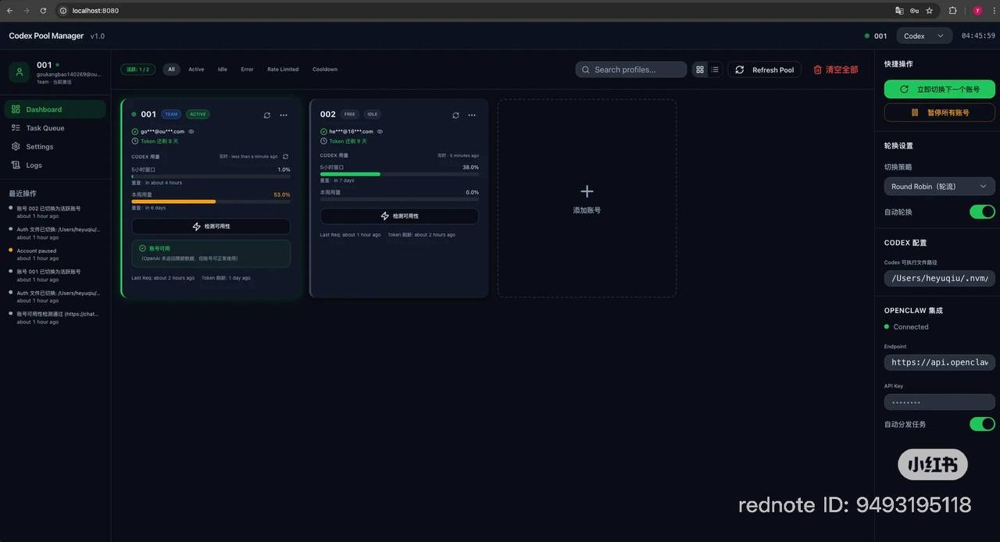
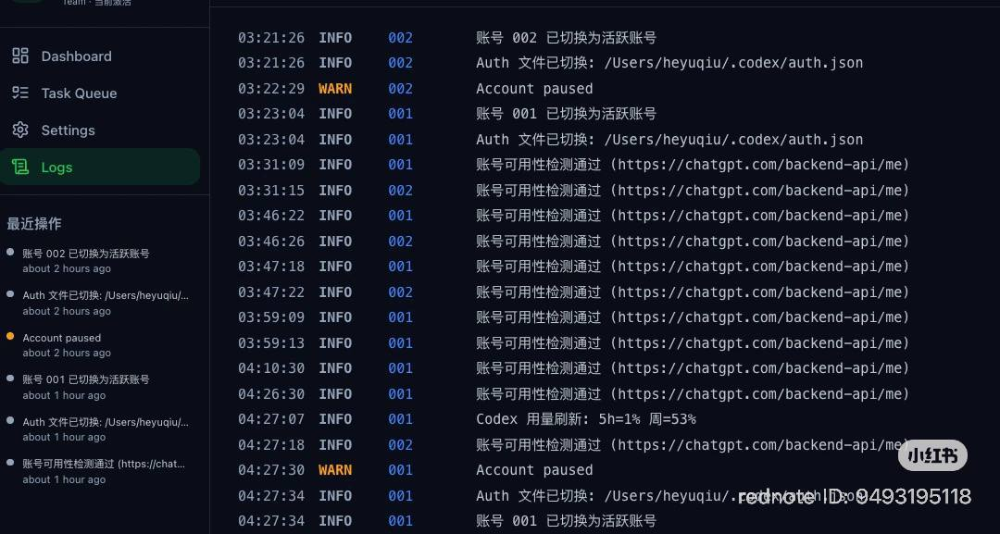
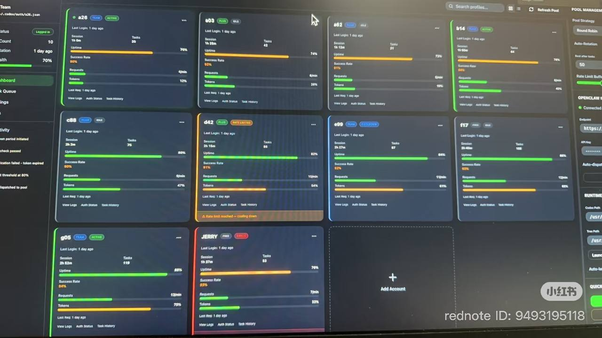

# Codex Account Manager

A dashboard for managing multiple OpenAI Codex accounts (ChatGPT OAuth), with real-time usage monitoring and automatic account rotation.
> 原则上也可用于 Gemini / Claude 等账号管理，但我主要用 Codex，所以示例与实现以 Codex 为主。


## Features

- **Multi-account management** — Add and switch between multiple OpenAI Codex accounts using ChatGPT OAuth tokens
- **Real-time usage monitoring** — Shows 5-hour window and weekly quota usage by calling the Codex API directly
- **Auto-rotation** — Automatically switches to the next account when the 5-hour usage exceeds 90%
- **Smart polling** — Adjusts check frequency based on usage level (30min → 10min → 5min as usage increases)
- **Auth file switching** — Copies the selected account's `auth.json` to `~/.codex/auth.json` on activation
- **Token info** — Displays email, plan type, and token expiry decoded from JWT
- **Activity logs** — Real-time log feed with rotation events and usage checks

## Tech Stack

- **Frontend**: React + TypeScript + Vite + Tailwind CSS + shadcn/ui
- **Backend**: Express.js + Node.js
- **Database**: MySQL (via XAMPP)

## Prerequisites

- Node.js 18+
- MySQL (XAMPP recommended on macOS)
- OpenAI Codex CLI installed (`npm install -g @openai/codex`)
- ChatGPT Plus / Team / Pro account with Codex access

## Setup

### 1. Clone the repo

```bash
git clone https://github.com/YOUR_USERNAME/codex-account-manager.git
cd codex-account-manager
```

### 2. Install dependencies

```bash
npm install
```

### 3. Configure environment

```bash
cp .env.example .env
```

Edit `.env` with your database credentials:

```env
PORT=3001
FRONTEND_ORIGIN=http://localhost:8080
DB_HOST=127.0.0.1
DB_PORT=3306
DB_SOCKET=/Applications/XAMPP/xamppfiles/var/mysql/mysql.sock
DB_USER=root
DB_PASSWORD=
DB_NAME=codex_pool_manager
VITE_API_BASE_URL=http://localhost:3001
```

### 4. Create the database

Start MySQL, then create a database named `codex_pool_manager`. The server will auto-create all tables on first run.

### 5. Start the app

```bash
# Start backend
node server/index.js

# Start frontend (in another terminal)
npm run dev
```

Open [http://localhost:8080](http://localhost:8080)

## How to add accounts

1. Log into Codex CLI with your ChatGPT account:
   ```bash
   codex login
   ```
2. Copy the generated auth file:
   ```bash
   cp ~/.codex/auth.json ~/Desktop/openai-accounts/acc1.json
   ```
3. In the Dashboard, click **+ Add Account** and enter the path to your auth file (e.g. `~/Desktop/openai-accounts/acc1.json`)

Repeat for each account.

## Auto-rotation

Enable **Auto-rotation** in the right sidebar. The system will:

| 5h Usage | Check Interval |
|---|---|
| < 50% | Every 30 minutes |
| 50–80% | Every 10 minutes |
| > 80% | Every 5 minutes |
| **> 90%** | **Switch immediately** |

Switch events are logged in the Dashboard activity feed.

## Notes

- Auth files contain OAuth tokens — keep them secure and do not commit them to version control
- Each usage check consumes a small number of Codex tokens (rounds to ~0% of the 5h window)
- The auto-rotation only activates when the **Auto-rotation** toggle is enabled

## License

MIT


## Screenshots

部署界面预览：





## 更新动态

我会持续更新，感兴趣可以关注我的抖音：


