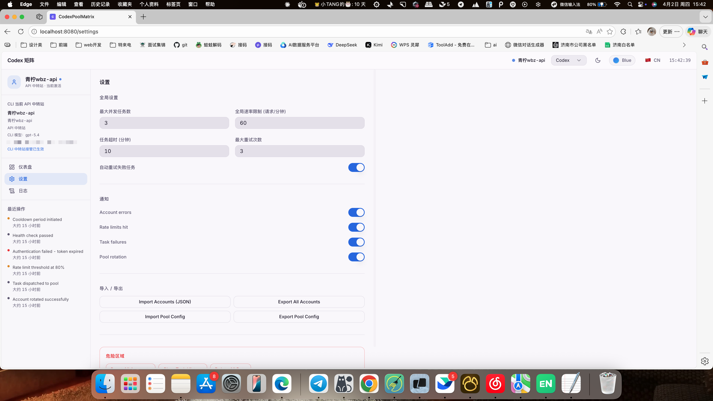

# CodexPoolMatrix

[](LICENSE)
[](https://github.com/songlujie/CodexPoolMatrix/stargazers)
[](https://nodejs.org)

多账号 Codex 管理仪表板，支持 OAuth 账号和 API 中转站账号，提供实时用量检测、自动轮换、批量 Token 刷新，以及可选的 OpenClaw 同步。

---

## ✨ Features

- **平台分类** — 支持 GPT、Gemini、Claude 等多平台账号，可自定义添加新平台
- **OAuth 一键登录 / 扫描导入** — 在界面内直接完成 `codex login` 授权，或批量扫描 auth 文件导入
- **API 中转站账号** — 支持添加 `Base URL + API Key + 模型名` 的 API 账号，并在切换时接管 Codex CLI 配置
- **批量用量检测** — 一键检测所有账号状态，OAuth 账号显示 5h / 周用量，API 账号检测中转站与模型可用性
- **自动轮换** — 按策略选择下一个账号；当当前 OAuth 账号 5h 用量达到 90% 时自动切换
- **自动 Token 刷新** — 支持按 24h / 48h / 72h / 120h / 168h 周期批量刷新 OAuth 账号 Token
- **OpenClaw 可选集成** — 切换 OAuth 账号时可同步 `auth-profiles.json` 并触发 OpenClaw 重载
- **亮暗主题** — 支持深色 / 浅色模式随时切换
- **紧凑列表视图** — 网格视图和紧凑列表视图自由切换
- **实时日志** — 完整记录轮换事件、Token 刷新、用量检测

## 📸 Screenshots

| Dashboard | Add Account |
| --- | --- |
|  |  |

| Settings | Logs |
| --- | --- |
|  |  |

---

## 🛠 Tech Stack

- **Frontend**: React 18 + TypeScript + Vite 5 + Tailwind CSS + shadcn/ui
- **State / UX**: TanStack Query + Framer Motion + Sonner
- **Backend**: Node.js + Express 4 + dotenv
- **Database**: MySQL 8 + mysql2
- **Runtime**: Node.js 18+ and npm

---

## 🤝 Contributing

See [CONTRIBUTING.md](CONTRIBUTING.md) for the team workflow and branch strategy.

---

## 🚀 Quick Start

### 1. Clone

```bash
git clone https://github.com/songlujie/CodexPoolMatrix.git
cd CodexPoolMatrix
```

### 2. Install

```bash
npm install
```

### 3. Prepare Database

This project currently runs against **MySQL 8**. If you already have a local MySQL instance, you can skip this step and use your own connection info.

Example Docker startup:

```bash
docker run -d \
  --name codexpool-mysql \
  -p 3306:3306 \
  -e MYSQL_ROOT_PASSWORD=123456 \
  -e MYSQL_DATABASE=codex_pool_manager \
  mysql:8.0
```

### 4. Configure Environment

```bash
cp .env.example .env
```

Edit `.env`:

```env
PORT=3001
FRONTEND_ORIGIN=http://localhost:8080
NODE_USE_ENV_PROXY=1
HTTP_PROXY=
HTTPS_PROXY=
ALL_PROXY=
NO_PROXY=127.0.0.1,localhost,::1
DB_HOST=127.0.0.1
DB_PORT=3306
DB_SOCKET=
DB_USER=root
DB_PASSWORD=123456
DB_NAME=codex_pool_manager
VITE_API_BASE_URL=http://localhost:3001
```

Notes:

- `DB_SOCKET` 留空时走 TCP 连接
- 如果你已有自己的 MySQL，请把 `DB_USER / DB_PASSWORD / DB_NAME` 改成你的实际值
- 如果网络依赖本地代理，填写 `HTTP_PROXY / HTTPS_PROXY`

### 5. Run

```bash
# Terminal 1 — backend
npm run server

# Terminal 2 — frontend
npm run dev
```

### 6. Open

- Frontend: [http://localhost:8080](http://localhost:8080)
- Backend API: [http://localhost:3001](http://localhost:3001)

The backend initializes tables automatically on first run.

If you prefer to access the frontend via `127.0.0.1`, update `FRONTEND_ORIGIN` in `.env` to match it.

---

## ➕ Adding Accounts

### 方式一：添加 OAuth 账号（推荐）

1. 点击右上角 **+ 添加账号**
2. 点击 **一键登录新账号**
3. 在弹出的终端中完成浏览器 OAuth 授权
4. 授权成功后账号自动保存 ✅

### 方式二：扫描导入已有 auth 文件

1. 在终端执行 `codex login`，完成授权
2. 复制 auth 文件：`cp ~/.codex/auth.json ~/Desktop/openai-accounts/acc1.json`
3. 点击 **+ 添加账号 → 扫描**，选择文件路径

### 方式三：添加 API 中转站账号

1. 点击右上角 **+ 添加账号**
2. 进入 **API 账号** 视图
3. 填写 `账号名`、`Base URL`、`API Key`
4. 可选填写 `模型名` 和 `CLI Config Snippet`
5. 保存后，这个账号会以 `provider_mode=api` 加入池中

说明：

- API 账号不依赖 `auth.json`
- API 账号不会参与 OAuth Token 刷新
- 切换到 API 账号时，后端会改写 Codex CLI 的 provider / model / base_url / api key 配置

---

## 🎛 Right Sidebar

右侧栏会自动保存设置，前端有 300ms 防抖，后端保存到 `settings` 表。

### 快捷操作

- **立即切换下一个账号**：立刻执行一次轮换
- **检测所有账号用量**：批量刷新账号卡片状态
- **批量刷新 Token**：对所有 OAuth 账号执行一次手动刷新

### 轮换设置

- **Strategy**
  - `Round Robin`：按顺序轮换
  - `Least Used`：优先选择当前用量最低的账号，推荐
  - `Random`：随机选择
  - `Priority Based`：优先 `team > plus > free`，同组再比用量
- **Auto Rotation**
  - 开启后，后端会定期检查当前活跃账号
  - 当前逻辑只会基于 OAuth 账号的 5h 用量自动切换
  - 达到 90% 时，按当前策略切到下一个可用账号
- **Auto Token Refresh**
  - 开启后，后端会按设定周期批量刷新 OAuth 账号 Token
  - API 中转站账号不会参与这里的刷新
- **Refresh Interval**
  - 当前可选：24h、48h、72h、120h、168h

### Codex 配置

- **Codex Path**
  - 留空时自动从 PATH 探测 `codex`
  - 只有在系统里找不到 `codex` 命令时才需要手动填写

### OpenClaw 集成

- 这是可选功能，不用 OpenClaw 可以直接忽略
- **Reload OpenClaw** 会先同步当前 OAuth 账号到 `~/.openclaw/agents/main/agent/auth-profiles.json`，再尝试重载 OpenClaw
- 当前右侧栏里的 `OpenClaw Endpoint`、`API Key`、`Auto Dispatch` 主要还是预留字段，会保存到数据库，但对当前运行逻辑没有明显直接影响

---

## 🔄 Auto-Rotation

自动轮换会根据当前活跃账号的 5h 用量动态调整检测频率：

| 5h 用量 | 检查间隔 |
|--------|---------|
| < 50%  | 每 30 分钟 |
| 50%–79% | 每 10 分钟 |
| 80%–89% | 每 5 分钟 |
| >= 90% | 本次检查直接切换 |

自动轮换使用右侧栏配置的 `Strategy` 选择目标账号。

---

## ⚠️ Notes

- Auth 文件包含 OAuth Token，请勿提交到版本控制
- OAuth 用量检测调用零 Token 接口，不消耗 Codex 配额
- 自动轮换仅在开启 **自动轮换** 开关时生效
- 自动 Token 刷新仅对 OAuth 账号生效
- 未启用 OpenClaw 时，后端会静默跳过相关同步和监控逻辑

---

## Repository
https://github.com/songlujie/CodexPoolMatrix

---

## License

MIT
